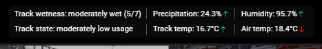

# Forked from https://github.com/Rovlgut/ir_WeatherApp. Thanks to Rovlgut for the original work.

This is a very basic implementation over Rovlgut's original work, with little changes to fit my personal preferences. 
I haven't updated this implementation to the latest version of Rovlgut's original work, so it may be missing some of the latest features.
This is intended for personal use, but feel free to use it as a base for your own implementation. 
I will not be maintaining this fork, so if you want to use it, you should probably fork it yourself and maintain it.

# Description

Weather App for Kapps. Based on [iRacing Browser Apps ](https://ir-apps.kutu.ru/).

Shows track wetness, precipitation, humidity, track state, track temp and air temp.

# Install

- Make folder that Kapps will make link.
(Recommend in iRacing document make folder CustomApps, so not to lost it.)

- Extract app folder WeatherApp.
    Should look like: Documents\iRacing\CustomApps\WeatherApp. In WeatherApp should be folders 'libs', 'css' and 'fonts'; files 'app.coffee' and 'index.html'
    
- Run Kapps with admin (Kapps need to create symlink). In tab 'App' open 'Settings'. Add folder to 'App Folder'. Need to select folder that in first step (CustomApps). And 'Save'
    To check if it worked, got to folder `%AppData%\Kapps\iRacingBrowserApps`. There should be shortcut 'apps' that leads to our folder. If not, try close and run Kapps as admin again. Or make it yourself, google will help.

- Go to 'Racing Overlay'. Scroll down and 'Add Custom Overlay'. Enter name, url and tick boxes what needed ('not in iRacing' for sure)
    - Name can be any.
    - URL must be 'http://127.0.0.1:8182/WeatherApp/'

Now you can open overlay in edit new box.

Original author: Rovlgut